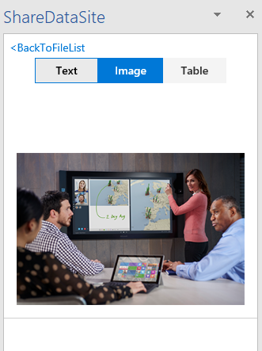
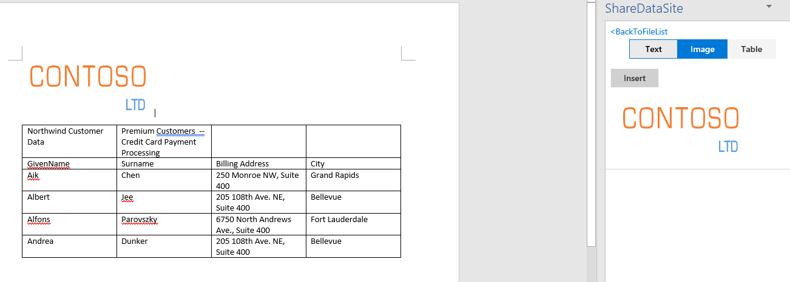

# Exercise to add code to pull in images from Word and Excel documents

## Sample code to WordParse.cs: 

// Find image and add to the result.

foreach (var slide in slideParts)
{
    var images = slide.ImageParts.Select(m=>
	{
	      var stream = m.GetStream();
	      var streamByteArray = new byte[stream.Length];
	      stream.Read(streamByteArray, 0, (int)stream.Length);
	      return new TempData  { StorageType = StorageType.ImageType, Data = Convert.ToBase64String(streamByteArray) };
	});

	result.AddRange(images);
}

## Sample code to ExcelParse.cs: 

// Get all the images in the document.
                        
if (worksheetPart.DrawingsPart != null && worksheetPart.DrawingsPart.ImageParts != null)                       
{                           
    var imgs = worksheetPart.DrawingsPart.ImageParts.Select(m =>                           
    {                           
          stream = m.GetStream();                           
          streamByteArray = new byte[stream.Length]; 
          stream.Read(streamByteArray, 0, (int)stream.Length);
          return new TempData { StorageType = StorageType.ImageType, Data = Convert.ToBase64String(streamByteArray) };                            
    }).ToArray();  
                          
    result.AddRange(imgs);
                        
}
                    

## Then build the solution in Visual Studio, now the image contents show up for Word and Excel documents.

## You can pull in images from Word and Excel documents.

